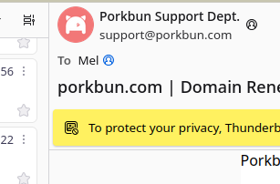

# Retrieve Remote Avatar for Thunderbird

This experimental addon for Thunderbird fetches a remote avatar from various sources (listed below) if one isn't already  set.

The avatars are cached in the addon's local storage space, which can be cleared in the addon's preferences. By default, avatars are cached for 3 days, after which will be re-fetched when you click on an email containing it.

## Sources

* Libravatar
* Gravatar

Additionally, you can specify a custom source using a standard URL and the variables `$hash` (for a sha256 hash of the email) or `$domain` (for the email domain.) Allowing you to use services like [https://icon.horse/](https://icon.horse/).
